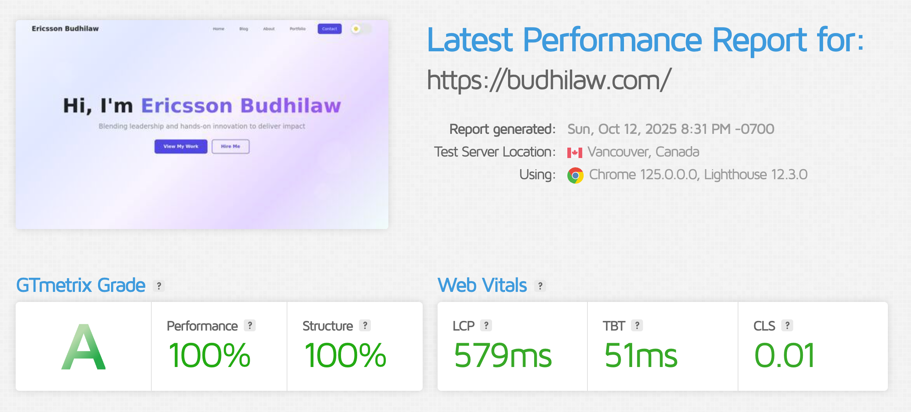
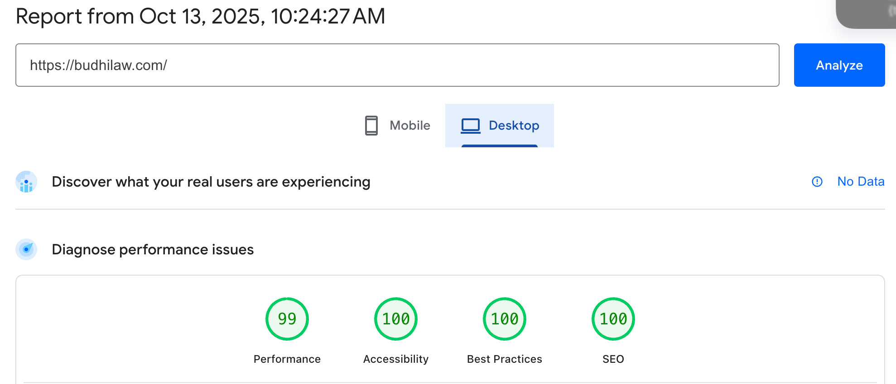
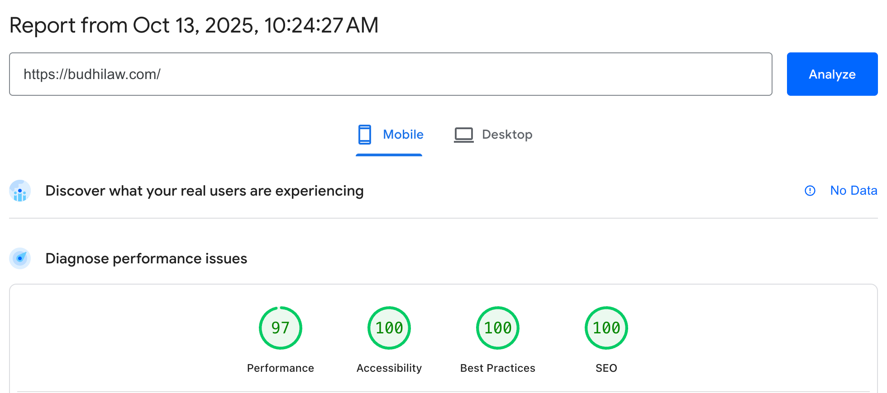

# Rangin — A Personal WordPress Theme for Software Engineers

Rangin is a modern, performance‑minded WordPress theme designed to help software engineers showcase their work, publish articles, and convert visitors into clients. It balances a clean UI with thoughtful defaults, so a fresh site looks polished the moment you activate the theme.

This theme is intended for standard WordPress installations (no special tooling required).

## Performance Scores

Rangin is built with performance as a top priority. Here are the latest benchmark results:

### GTMetrix Grade: **A**

- **Performance:** 100%
- **Structure:** 100%
- **LCP (Largest Contentful Paint):** 579ms
- **TBT (Total Blocking Time):** 51ms
- **CLS (Cumulative Layout Shift):** 0.01

### PageSpeed Insights (Lighthouse)

**Desktop Performance:**

**Mobile Performance:**

- **Performance:** 99/100 (Desktop) | 99/100 (Mobile)
- **Accessibility:** 100/100
- **Best Practices:** 100/100
- **SEO:** 100/100

**Key Performance Features:**
- Optimized Font Awesome subset (2.5KB vs 500KB+ full library)
- Efficient browser caching with immutable cache headers
- Minified CSS and JavaScript assets
- Optional AVIF/WebP image conversion
- Modern lazy-loading and responsive images
- Minimal render-blocking resources
- Optimized critical rendering path

## Highlights

- Elegant landing experience with a focused content hierarchy
- Portfolio custom post type with categories (Frontend, Backend, Mobile)
- Beautiful, ready‑to‑use page templates:
  - Front Page (dynamic hero, sections, call‑to‑actions)
  - Portfolio Page (grid with filters)
  - About Page (story + content)
  - Contact Page (polished contact information + social links)
- Smart activation routines (zero‑config start):
  - Creates pages: Home, Blog, Portfolio, About, Contact
  - Sets “Home” as Front Page and “Blog” as Posts Page (when unset)
  - Creates Portfolio categories and demo items (once)
  - Builds default menus: Primary (header) and Footer
  - Populates widgets for Blog Sidebar and Footer
  - Assigns page templates for About/Portfolio/Contact
- TailwindCSS styling with utility classes + card components
- Accessibility‑aware defaults and responsive behavior
- Image and asset optimization options
- Thoughtful admin experience via Theme Options screen

## Installation

1) Upload the theme to your site
- Zip this folder (`rangin`) and upload via: Appearance → Themes → Add New → Upload Theme
  or
- Copy this folder into your server’s `wp-content/themes/` directory

2) Activate the theme
- In WordPress admin: Appearance → Themes → Activate “Rangin”

On activation, Rangin will:
- Create pages (only if missing): Home, Blog, Portfolio, About, Contact
- Set “Home” as Front Page and “Blog” as Posts Page if Reading settings are unset
- Create Portfolio categories (slugs): `frontend`, `backend`, `mobile`
- Create 3 demo Portfolio items if no portfolio exists yet
- Create menus:
  - Primary Menu (Home, Blog, About, Portfolio, Contact) and assign to header
  - Footer Menu (Blog, About, Contact) and assign to footer
- Populate widgets:
  - Blog Sidebar: Rangin – Search, Rangin – Recent Posts, Rangin – Categories
  - Footer: Rangin – Quick Links (binds to Footer Menu), Rangin – Contact Info (auto‑filled from Theme Options)
- Assign templates:
  - About → “About Page” (page-about.php)
  - Portfolio → “Portfolio Page” (page-portfolio.php)
  - Contact → “Contact Page” (page-contact.php)

To re‑run the activation setup later, temporarily switch to a different theme and back to Rangin.

## Theme Options (Admin)

Rangin adds a “Theme Options” top‑level menu in WordPress admin with a focused set of controls:

- General
  - Site name (shortcut), brand/title/description for footer
  - Social links (LinkedIn, GitHub, GitLab, X/Twitter, Facebook, Instagram, Threads)
- Front Page
  - Hero copy, CTAs, optional animated background
  - Contact section details (email, phone, location, CTA text)
- About Page
  - “About Me” photo and description
- Services
  - Services list (JSON) with title, description, icon, background, features
- Portfolio
  - Titles, descriptions, count for front page sections
- Image Optimization
  - Convert uploads to AVIF/WebP, quality, limits, bulk conversion runner
- Asset Optimization
  - Minify theme CSS/JS to uploads cache; optional vendor minifier support
- Cloudflare (optional)
  - Rewriting for Cloudflare Image Resizing + quality settings

You can safely ignore sections you don’t need — the theme ships with sensible defaults.

## Portfolio

- Post type: `portfolio`
- Taxonomy: `portfolio_category`
- Activation creates three categories by default:
  - Frontend (slug: `frontend`, color auto‑mapped)
  - Backend (slug: `backend`)
  - Mobile (slug: `mobile`)
- Demo items are created only when there are no portfolio posts, to give you an immediate visual.
- Single item view uses `single-portfolio.php`.

## Widgets

Custom widgets (Appearance → Widgets):
- Rangin – Search
- Rangin – Recent Posts
- Rangin – Categories
- Rangin – Quick Links (binds to a chosen menu; defaults to Footer Menu)
- Rangin – Contact Info (email/phone/address; auto‑filled from Theme Options)

On first activation, the theme arranges:
- Blog Sidebar: Search, Recent Posts, Categories
- Footer: Quick Links (Footer Menu) and Contact Info (pre‑filled)

## Menus

- Primary Menu (header): Home, Blog, About, Portfolio, Contact
- Footer Menu: Blog, About, Contact
- Edit both menus in Appearance → Menus.

## Page Templates

- Front Page: `front-page.php` (automatically used for your Front Page)
- About Page: `page-about.php`
- Portfolio Page: `page-portfolio.php`
- Contact Page: `page-contact.php` (polished, form‑less contact page with contact details + social links)

## Assets & Builds (optional)

If you plan to modify styles/scripts:

- Install dependencies in this folder:
  - `npm install`
- Development build (watch):
  - `npm run dev` (front‑end and admin CSS)
- Production build:
  - `npm run build` (minified CSS)
  - `npm run build:js` (minified JS via terser)

Optional vendor minifier
- The theme can leverage `matthiasmullie/minify` for higher‑quality minification if available.
- In this folder, run:
  - `composer install` (or `composer require matthiasmullie/minify`)
- The theme auto‑detects `vendor/autoload.php` from project or theme scope.

Uploads cache
- Minified assets may be served from: `wp-content/uploads/rangin-cache/min`
- Theme Options → Asset Optimization includes a “Purge Minified Cache” button.

## Images

- Optional image conversion to AVIF/WebP with quality controls and limits.
- Bulk convert tool is included in Theme Options (step‑wise runner to avoid timeouts).
- Front end respects modern formats when available.

## Translations

- Text domain: `rangin`
- Load path: `load_theme_textdomain('rangin', get_template_directory() . '/languages')`
- To localize:
  - Create a `languages/` folder in this theme (if missing)
  - Generate a POT and MO files for `rangin`

## Troubleshooting

- Activation didn’t create pages/menus/widgets?
  - Switch to a different theme and back to Rangin to re‑trigger activation hooks.
- Quick Links widget points to the wrong menu?
  - On activation, it defaults to the Footer Menu. If you changed menus later, open the widget and choose a different menu.
- Permalinks for Portfolio look odd (`?p=`)?
  - Visit Settings → Permalinks and click “Save Changes” to refresh rewrite rules.

## Conventions & Coding Notes

- Text domain is consistently `rangin` across templates and admin.
- Portfolio slugs are human‑readable (`portfolio-item` for items, `portfolio-category` for taxonomy) and rewrite rules are flushed on activation.
- Activation logic is idempotent and conservative — it won’t override existing choices unnecessarily.
- Admin settings are designed to be useful but not overwhelming.

## License

Licensed under the GNU General Public License v2 or later.  
https://www.gnu.org/licenses/gpl-2.0.html

## Credits

- Built with TailwindCSS
- Optional minification by matthiasmullie/minify
- Icons via Font Awesome
